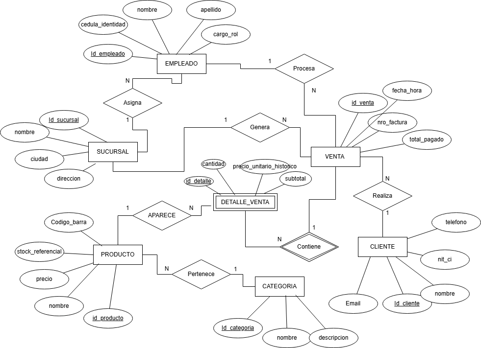
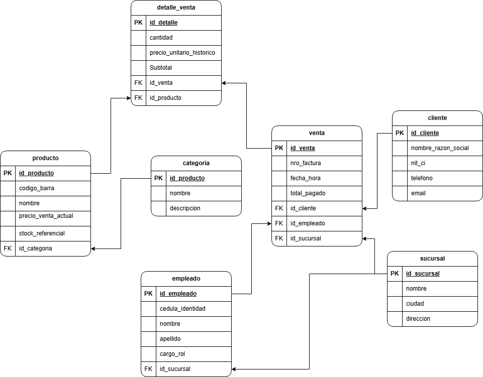

# 🏪 Minimarket Kwik-E-Mart - Sistema de Ventas
> **Proyecto Académico:** Base de Datos II  
> **Estado:** Finalizado ✅✅

---

## Descripción del Proyecto
El sistema de venta para el **Kwik-E-Mart** es una solución diseñada para la gestión operativa de un minimarket de alta rotación. El objetivo principal es garantizar la **consistencia de los datos** en un entorno transaccional, permitiendo un control preciso del flujo de ventas y la integridad referencial de la información.

A diferencia de sistemas administrativos complejos, este proyecto se enfoca específicamente en la eficiencia del **punto de venta (POS)**, optimizando la interacción entre el catálogo de productos y el registro final de transacciones.

## Funcionalidades Conseguidas
* **Seguridad Global:** Sistema protegido por un login genérico, restringiendo el acceso no autorizado.
* **Módulo de Punto de Venta (POS):** Pantalla interactiva con carrito de compras, cálculo de subtotales y validación de stock en tiempo real.
* **Gestión de Inventario (CRUD):** Administración completa de Categorías y Productos, previniendo la venta de artículos agotados.
* **Gestión de Clientes (CRUD):** Registro, edición y eliminación de clientes para vincularlos a las facturas.
* **Integridad Transaccional:** Uso de transacciones SQL (`COMMIT`, `ROLLBACK`) para garantizar que el registro de ventas y el descuento de stock ocurran de forma atómica y segura.

## Conclusión
El proyecto ha cumplido exitosamente su objetivo académico, logrando demostrar la importancia de una arquitectura de base de datos robusta acoplada a un patrón de diseño MVC. Se ha logrado implementar un flujo de ventas seguro y consistente, previniendo fallos de inventario y manteniendo un código escalable mediante el uso de vistas y relaciones estructuradas en PostgreSQL.

## Especificaciones Técnicas y Alcance
* **Motor de Base de Datos:** Se utiliza **PostgreSQL**, aprovechando su capacidad para manejar transacciones ACID y asegurar la fiabilidad de los datos financieros.
* **Arquitectura:** Diseñado bajo principios de normalización de datos para evitar redundancias y asegurar la integridad referencial.
* **Alcance Delimitado:** Para esta fase del proyecto, el sistema se centra exclusivamente en el flujo **Ventas -> Clientes**.
    * **Incluye:** Gestión de categorías, catálogo de productos y procesamiento transaccional de ventas.
    * **Excluye:** No se contempla la gestión de inventarios (stock dinámico), auditorías de almacén ni relación con proveedores.

## Enunciado del Caso de Estudio
El Kwik-E-Mart requiere un sistema para automatizar su flujo principal de ventas. El catálogo se organiza por Categorías (como Snacks o Bebidas), las cuales agrupan diversos Productos. Cada producto tiene un precio de venta definido y un stock de referencia.

El proceso central ocurre cuando un Empleado (cajero) registra una Venta para un Cliente. Esta transacción genera una cabecera con los datos generales (fecha, total, factura) y se desglosa en un Detalle de Venta, donde se vinculan los productos adquiridos, las cantidades y el precio capturado en el momento de la operación. El sistema garantiza que cada venta impacte en el historial del cliente y sea procesada por un empleado responsable en una Sucursal específica, manteniendo la integridad referencial en todo el flujo transaccional."

## Reglas de Negocio
Para asegurar el correcto funcionamiento del minimarket, el sistema implementa las siguientes reglas:

**Integridad de Precios:** Ninguna venta puede procesarse si el producto no tiene un precio de venta definido y vigente.
**Inmutabilidad del Detalle:** Una vez registrada la venta, el precio almacenado en el `Detalle_Venta` debe permanecer fijño, protegiendo el registro contra futuros cambios en el catálogo de productos.
**Identificación Obligatoria:** Toda transacción debe estar vinculada a un cliente (pudiendo ser un "Cliente Genérico") y a un empleado responsable para fines de auditoría.
**Consistencia Transaccional:** El registro de la cabecera de venta y sus detalles debe ocurrir de forma atómica; si falla un renglón del detalle, la venta completa se revierte para evitar datos huérfanos.
**Unicidad de Categorías:** Los productos solo pueden pertenecer a una categoría principal para simplificar la navegación y organización en el punto de venta.
___

## Estructura de Datos (Entidades y Atributos)

A continuación se detallan las entidades que componen el sistema del **Kwik-E-Mart**, junto con sus atributos principales (omitiendo claves foráneas para esta sección):

* **CATEGORÍA**: Clasificación lógica para organizar el catálogo.
    * `id_categoria` (PK), `nombre`, `descripcion`.
* **PRODUCTO**: Bienes disponibles para la venta.
    * `id_producto` (PK), `codigo_barra`, `nombre`, `precio_venta_actual`, `stock_referencial`.
* **CLIENTE**: Personas que realizan compras en el minimarket.
    * `id_cliente` (PK), `nombre_razon_social`, `nit_ci`, `telefono`, `email`.
* **EMPLEADO**: Personal responsable de la atención en cajas y gestión.
    * `id_empleado` (PK), `cedula_identidad`, `nombre`, `apellido`, `cargo_rol`.
* **SUCURSAL**: Puntos de venta físicos de la franquicia.
    * `id_sucursal` (PK), `nombre`, `ciudad`, `direccion`.
* **VENTA (Cabecera)**: Registro principal de la transacción comercial.
    * `id_venta` (PK), `nro_factura`, `fecha_hora`, `total_pagado`.
* **DETALLE_VENTA**: Desglose individual de cada artículo procesado en una venta.
    * `id_detalle` (PK), `cantidad`, `precio_unitario_historico`, `subtotal`.

---

## Relaciones y Cardinalidad

El modelo sigue las siguientes reglas de asociación para garantizar la integridad del flujo de ventas:

1.  **CATEGORÍA — PRODUCTO (1:N)**: Una categoría agrupa múltiples productos.
2.  **SUCURSAL — EMPLEADO (1:N)**: Cada sucursal cuenta con un equipo de empleados asignados.
3.  **CLIENTE — VENTA (1:N)**: Un cliente puede figurar en múltiples registros de venta.
4.  **EMPLEADO — VENTA (1:N)**: Un empleado es responsable de procesar numerosas ventas.
5.  **SUCURSAL — VENTA (1:N)**: Una sucursal genera un historial de múltiples ventas.
6.  **VENTA — DETALLE_VENTA (1:N)**: Una venta se compone de uno o varios registros de detalle.
7.  **PRODUCTO — DETALLE_VENTA (1:N)**: Un producto puede estar presente en los detalles de múltiples ventas.

---

## Modelo Entidad-Relación (DER)
A continuación se presenta la arquitectura lógica del sistema, detallando las conexiones entre las entidades descritas anteriormente.



---

## Modelo Relacional 
A continuación, se detalla el esquema lógico con llaves foráneas y cardinalidades finales, diseñado para garantizar la integridad referencial en PostgreSQL.


---

## Estado Actual y Avances

El proyecto se encuentra en una fase de desarrollo avanzado de los módulos base. Se han consolidado los siguientes pilares:

*   **Arquitectura y Entorno:**
    *   **MVC Realizado:** Implementación completa del patrón **Modelo-Vista-Controlador**.
    *   **Front Controller:** `index.php` actúa como enrutador central de peticiones.
    *   **Layout Dinámico:** Sistema de plantillas con Bootstrap 5 para una interfaz coherente.
*   **Base de Datos (PostgreSQL):**
    *   **Vistas de BD:** Implementación de `vista_productos_detallados` para optimizar consultas con Joins desde el motor de base de datos.
*   **Módulos Funcionales:**
    *   **Categorías:** CRUD completo (Crear, Leer, Actualizar, Eliminar).
    *   **Productos:** CRUD completo integrado con categorías y validación de stock mediante badges visuales.

---

## Estructura del Proyecto

La arquitectura del código se organizó utilizando el patrón **MVC (Modelo-Vista-Controlador)** clásico, separando claramente las responsabilidades del sistema:

```text
SISTEMA_VENTA/
├── config/           # Configuración (Conexión PDO a PostgreSQL)
├── controllers/      # Controladores (Lógica de negocio e intermediarios)
├── models/           # Modelos (Consultas e interacción con la BD)
├── views/            # Vistas (Interfaces de usuario - HTML/PHP)
├── public/           # Archivos estáticos públicos (CSS, JS, Imágenes)
├── scripts_sql/      # Scripts DDL, DML y Vistas para la BD
│   ├── Script DDL__Kwik-E-Mart.sql
│   └── vistas.sql    # Definición de Vistas de base de datos
├── diagramas/        # Recursos gráficos (DER, Modelo Relacional)
├── documentacion/    # Documentación auxiliar del sistema
├── debug_db.php      # Script temporal para pruebas y depuración
├── index.php         # Punto de entrada principal de la aplicación
└── README.md         # Documentación principal y bitácora
```

## Tecnologías Utilizadas
* **Backend:** PHP 8+ (Arquitectura MVC sin frameworks).
* **Base de Datos:** PostgreSQL (Uso de Transacciones, Vistas, Triggers y Procedimientos Almacenados).
* **Frontend:** HTML5, Vanilla JavaScript (para la lógica del carrito POS) y Bootstrap 5 (CDN).
* **Servidor Web:** Apache (XAMPP).

---

## Guía de Instalación y Despliegue Local

Sigue estos pasos para hacer funcionar el proyecto en tu máquina:

1. **Requisitos Previos:**
   - Instalar [XAMPP](https://www.apachefriends.org/es/index.html) para el servidor Apache y PHP.
   - Instalar [PostgreSQL](https://www.postgresql.org/download/) y [pgAdmin](https://www.pgadmin.org/).

2. **Descargar el Proyecto:**
   - Clona este repositorio o descarga el código en formato ZIP.
   - Extrae la carpeta completa dentro del directorio `htdocs` de tu instalación de XAMPP (usualmente en `C:\xampp\htdocs\SISTEMA_VENTA`).

3. **Preparar la Base de Datos:**
   - Abre pgAdmin y crea una nueva base de datos con el nombre: `kwik-E-mart`
   - Abre el script `scripts_sql/Script DDL__Kwik-E-Mart.sql` y ejecútalo para generar todas las tablas.
   - Ejecuta el script `scripts_sql/vistas.sql` para cargar las funciones avanzadas de la base de datos.
   - Por último, ejecuta `scripts_sql/datos_iniciales.sql` para sembrar los datos de prueba (Categorías, Productos, Clientes y la Sucursal/Cajero por defecto requeridos para vender).

4. **Conectar el Sistema:**
   - Abre el archivo `config/database.php` con tu editor de texto.
   - Verifica que el nombre de usuario (`user`) y la contraseña (`password`) coincidan con los de tu instalación local de PostgreSQL.

5. **Arrancar el Sistema:**
   - Abre el Panel de Control de XAMPP y presiona **Start** en el módulo de Apache.
   - Entra a tu navegador web y visita: `http://localhost/SISTEMA_VENTA/`
   - **Acceso al sistema:** Utiliza las credenciales genéricas establecidas para pruebas:
     - **Usuario:** `admin`
     - **Contraseña:** `admin123`

---
*Proyecto desarrollado para la materia de Base de Datos II.*
*Link del repositorio*
https://github.com/fernandoMaydana/Sistema_ventas_BDII.git
